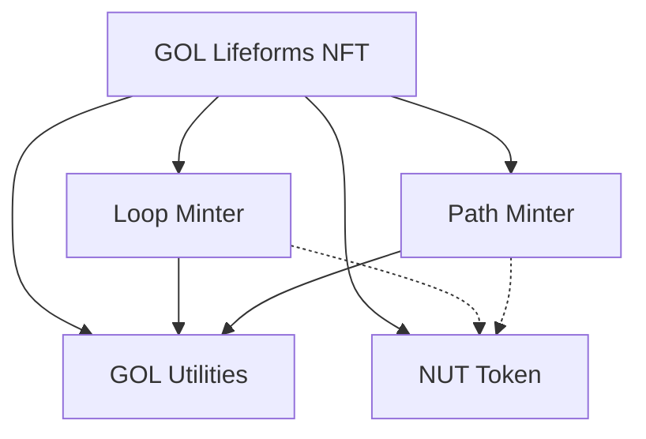

# Project Structure

## Overview

The Game of Life NFT system is composed of several interconnected smart contracts that work together to create a dynamic ecosystem of digital bacteria on StarkNet. Each contract has a specific role in maintaining and evolving the ecosystem.

## Contract Architecture

### Core Components

1. **GOL Lifeforms NFT Contract** (`gol_lifeforms.cairo`)
   - Central contract that manages all life forms in the ecosystem
   - Implements ERC721 for NFT functionality
   - Stores life form data and state
   - Controls evolution mechanics
   - Manages nutrient token interactions

2. **GOL Utilities** (`gol_utilities.cairo`)
   - Core logic for Conway's Game of Life rules
   - Grid manipulation and state management
   - Loop detection and validation
   - Path computation and verification

3. **Loop Minter** (`gol_loop_minter.cairo`)
   - Specialized contract for minting loop-type life forms
   - Validates loop patterns
   - Manages partial path registry for loop construction
   - Interacts with nutrient token for minting costs

4. **Path Minter** (`gol_path_minter.cairo`)
   - Specialized contract for minting path-type life forms
   - Validates paths leading to loops
   - Manages partial path registry for path construction
   - Interacts with nutrient token for minting costs

5. **Nutrient Token** (`gol_nutrient.cairo`)
   - ERC20 token representing nutrients in the ecosystem
   - Used for minting costs
   - Earned through participation in evolution
   - Controls ecosystem economics

## Contract Interactions

### Minting Process
1. Users interact with either the Loop Minter or Path Minter
2. Minters validate the pattern using GOL Utilities
3. Upon validation, minters interact with GOL Lifeforms to create the NFT
4. NUT tokens are transferred as minting cost

### Evolution Process
1. Users trigger evolution through GOL Lifeforms
2. GOL Utilities compute the next state
3. State is updated in GOL Lifeforms
4. NUT tokens are awarded for participation

### Partial Path System
1. Users can create partial paths through minters
2. Paths are stored in minter-specific registries
3. Paths can be combined to create complete patterns
4. Combined patterns can be minted as complete life forms

## Storage Architecture

Each contract maintains its own storage for specific functionalities:

- **GOL Lifeforms**: Stores NFT ownership and life form data
- **Minters**: Store partial path registries
- **NUT Token**: Manages token balances and allowances

## Access Control

The system implements role-based access control:
- Admin roles for contract upgrades
- Minter roles for NFT creation
- Public access for evolution and trading 